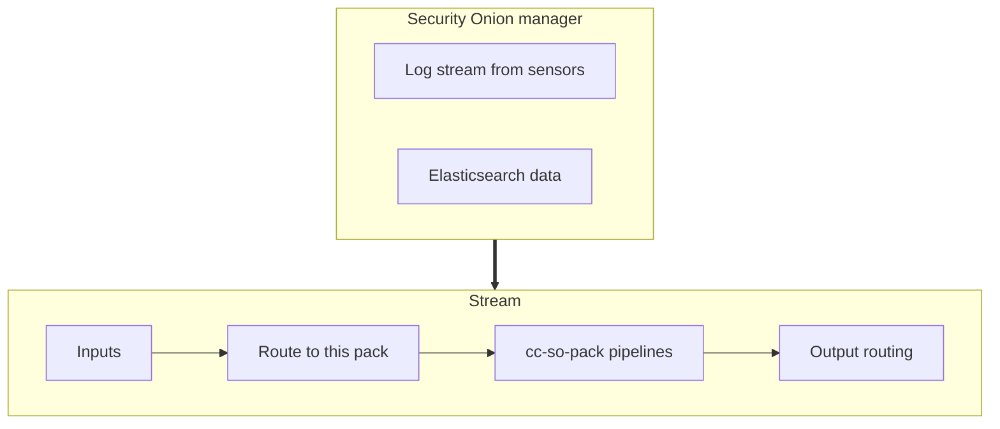

# cc-securityonion-pack
Stream pack for Security Onion

## Requirements
This pack is developed based on Security Onion version 2.3.150 and Cribl Stream version 3.5.3

## Release Notes
I have never released this pack

## Data Flow diagram

## Contributing to the Pack
I welcome contributions, either via issues or pull requests on this repository, or reach out to me
via slack or email.

## Contact
I can be reached via jpvlsmv+ccso@gmail.com

## License
This pack is released under the Apache-2 license, see LICENSE for details.
